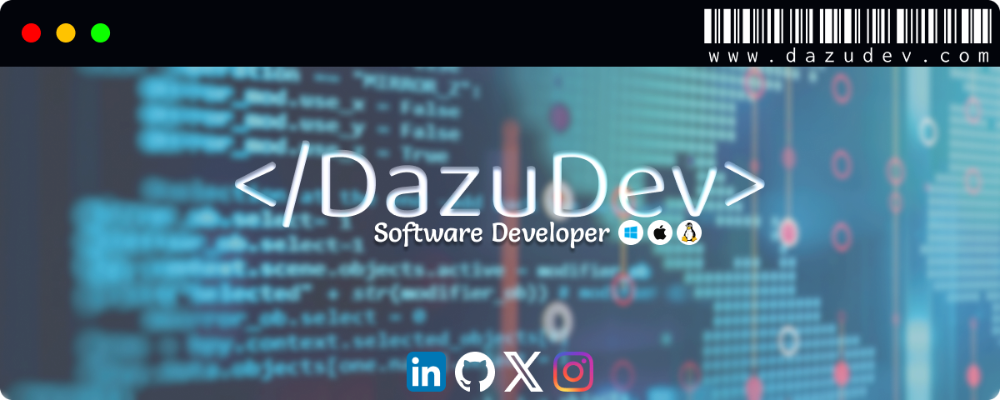

<!-- Animated typography -->

  

<!-- Banner -->

<!-- Contact -->

## 
Contact

  <table>
    <tr>
      <td align="center">
        
      </td>
      <td align="center">
        <a href="mailto:contact@dazudev.com">contact@dazudev.com</a>
      </td>
    </tr>
    <tr>
      <td align="center">
        
      </td>
      <td align="center">
        <a href="https://www.linkedin.com/in/dazu">Daniel Zúñiga (Dazu)</a>
      </td>
    </tr>
  </table>

<!-- Skills -->

## 
My Skill Set

### Frontend

  

### Backend

  

### Other Technologies

  

<!-- I currently use -->

## 
I currently use this tools

  

<!-- Operative Sistems -->

## 
Operating Systems I Manage

  
  
  
  
  

<!-- Languages -->

## 
Languages

<table align="center">
  <tr>
    <td align="center">
      Español | Spanish Native 
      
    </td>
    <td align="center">
      English | Inglés Learning 
      
    </td>
  </tr>
</table>

<!-- About Me -->

## 
About Me

  
  Hello! I'm passionate about technology, specifically programming, software development, and hardware.  
  I enjoy learning new programming languages and working on small projects. My latest projects include automating processes in Windows using .bat, .vbs, .reg, and .ps1 files.  
  I'm currently in my last year of high school in Mexico, and in my free time, I study programming and set up cool projects like Pi-Hole with Ubuntu.

 

<!-- GitHub statistics -->

  <picture>
    <source srcset="https://github-readme-stats.vercel.app/api?username=DazuDev&show_icons=true&theme=transparent&rank_icon=github&border_color=8a4af3&title_color=8a4af3&text_color=FFFFFF&icon_color=8a4af3" media="(prefers-color-scheme: dark)">
    
  </picture>

<!-- Footer -->

