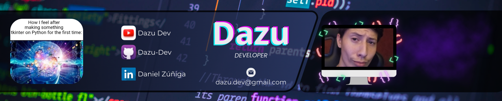
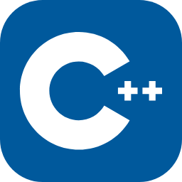
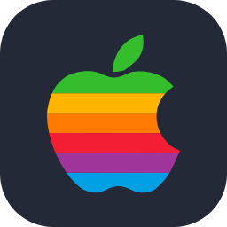

<!-- For the icons I used the website skillicons (https://skillicons.dev/) -->

<!-- (https://capsule-render.vercel.app/) -->

<!-- Banner -->

<!--  -->

<!-- Typing Animation - I used this repo to animate the text (https://github.com/DenverCoder1/readme-typing-svg) -->

  

<!-- Contact Section -->

## 
Contact

  <table cellspacing="0" cellpadding="0" style="border-collapse: collapse;">
    <tr>
      <td align="center">
        
      </td>
      <td align="center"><a href="mailto:dazu.dev@gmail.com">dazu.dev@gmail.com</a></td>
    </tr>
    <tr>
      <td align="center">
        
      </td>
      <td align="center"><a href="https://www.linkedin.com/in/dazu/">Daniel Zúñiga (Dazu)</a></td>
    </tr>
  </table>

<!-- Skill Set Section -->

# 
My Skill Set

### Frontend

  &nbsp;&nbsp;&nbsp;
  &nbsp;&nbsp;&nbsp;
  

### Backend

  &nbsp;&nbsp;&nbsp;
  &nbsp;&nbsp;&nbsp;
  

### Other Technologies

  &nbsp;&nbsp;&nbsp;
  &nbsp;&nbsp;&nbsp;
  &nbsp;&nbsp;&nbsp;
  

### Learning..

  &nbsp;&nbsp;&nbsp;
  &nbsp;&nbsp;&nbsp;
  

<!-- Currently Working On Section -->

## 
I'm Currently Working On

  &nbsp;&nbsp;&nbsp;
  &nbsp;&nbsp;&nbsp;
  &nbsp;&nbsp;&nbsp;
  &nbsp;&nbsp;&nbsp;
  

<!-- Operating Systems Section -->

## 
Operating Systems I Manage | And Their Terminals

  &nbsp;&nbsp;&nbsp;
  &nbsp;&nbsp;&nbsp;
  &nbsp;&nbsp;&nbsp;
  &nbsp;&nbsp;&nbsp;
  

<!-- Lenguages -->

## 
Lenguages

<table align="center" border="10">
  <tr>
    <td valign="top">
      
Español | Spanish Native

      
 

    </td>
    <td valign="top">
      
English | Inglés Learning

      
 

    </td>
  </tr>
</table>

<!-- About -->

## 
About me

  

Hello! In this section, I'll talk a bit about myself.  

To start, I'm someone who loves technology, specifically programming, software development, and assembling components that result in functional hardware.  

When I have free time to study, I delve into programming languages and enjoy working on small projects. My recent projects have focused on automating processes and actions in Windows using files with extensions like .bat, .vbs, .reg, .ps1, among others.  

  

Currently, I'm in the sixth semester of high school in Mexico, I'm 18 years old, and I'm learning English. At my school, I specialize in the area of physical-mathematics. In the afternoons, I attend mandatory extracurricular classes where I study topics of interest with my teacher, which are accessible to the class. Recently, we set up a Pi-Hole using Ubuntu, which has been useful for blocking ads from the modem/router.

    

<!-- GitHub Stats Section - (https://github.com/anuraghazra/github-readme-stats) -->

  <picture>
    <source srcset="https://github-readme-stats.vercel.app/api?username=DazuDev&show_icons=true&theme=transparent&rank_icon=github&border_color=8a4af3&title_color=8a4af3&text_color=FFFFFF&icon_color=8a4af3" media="(prefers-color-scheme: dark)">
    
  </picture>

<!-- Footer - (https://capsule-render.vercel.app/) -->

